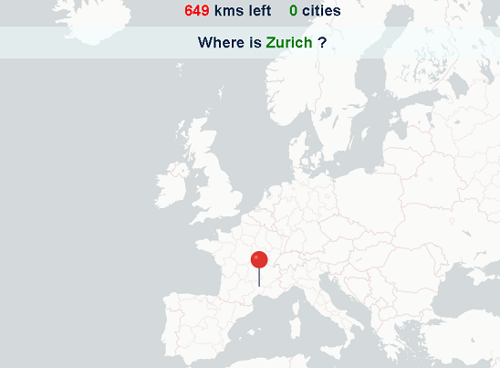

# SpotACity

This is a game made with React and Redux.


## Installation

To install dependecies use:
```shell
npm install
```

## Development

To start the application in development use:

```shell
npm start
```

## Production

To set the application for production using Webpack:

```shell
npm run build
```

## Deployment

This app has been deploy in Surge. If you want to test it in a production environmet go to the folloring URL:

http://spotacity.surge.sh/

## Views
### Main
<p align=center></p>

## How to store the hight score
One posible way to store the high score would be using LocalStorage. We could also use a database to persist data like high score.

## Ideas to improve the game
Here are some ideas to improve the game:
+ Add a timer, so the user have limited time to find the cities location. 
+ Instead of showing the right location, give three tries to spot the city correctly, showing not only the distance to city but also the direction (70 km NW).
+ Create a ranking of users, based on who has spotted the nine cities, ordered by time.
+ Adding more cities and different levels. For example: Level 1: Cities of Europe; Level 2: Cities of America, Level 3: Cities of Africa, etc.
+ Add some music.
