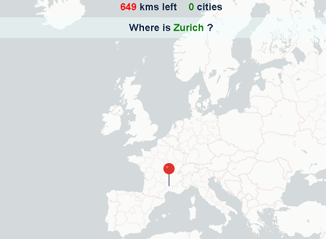

# SpotACity

This is a game made with React and Redux.


## Installation

To install dependecies use:
```shell
npm install
```

## Development

To start the application in development use:

```shell
npm start
```

## Production

To set the application for production using Webpack:

```shell
npm run build
```

## Deployment

This app has been deploy in Surge. If you want to test it in a production environmet go to the folloring URL:

http://spotacity.surge.sh/

## Views
### Main
<p align=center></p>